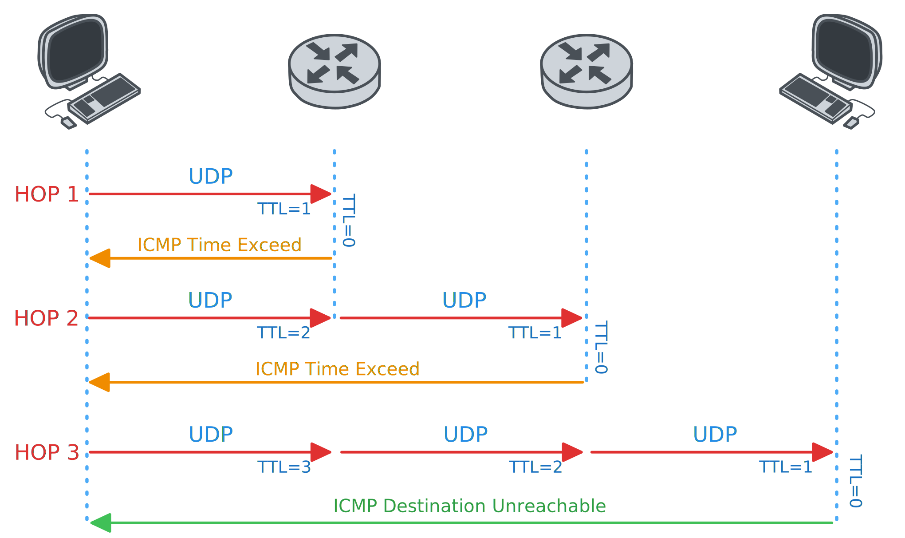

# traceroute-rust

`traceroute-rust` is a simple implementation of the [traceroute](https://man.freebsd.org/cgi/man.cgi?query=traceroute&sektion=8) tool,
written in Rust. This project was created as a learning exercise to better understand Rust and the basic concepts of networks.
This Rust-based implementation is a simplified version of the original traceroute and is intended for educational purposes
and personal enjoyment.
```
Usage: traceroute [OPTIONS] <DESTINATION_ADDRESS>

Arguments:
  <DESTINATION_ADDRESS>  

Options:
      --hops <HOPS>                                          [default: 30]
  -q, --queries-per-hop <QUERIES_PER_HOP>                    [default: 3]
  -p, --initial-destination-port <INITIAL_DESTINATION_PORT>  [default: 33434]
  -w, --wait <WAIT>                                          [default: 3]
  -h, --help                                                 Print help
  -V, --version                                              Print version
```

## What is Traceroute
Traceroute allows you to see the path an IP packet takes from one host to another. It uses the **TTL (Time To Live)** field
in the IP packet to elicit an **ICMP Time to Live Exceeded** message from each router along the path. Each router that handles the
packet decreases the TTL field, which effectively acts as a Hop Counter. When a router receives an IP datagram with the
TTL field set to 0, it responds with an ICMP Time to Live Exceeded that reveals its IP address. IP datagrams can be sent with TCP, UDP or with ICMP.


## Main Libraries
- [socket2](https://crates.io/crates/socket2) (includes raw sockets)
- [libpacket](https://docs.rs/libpacket/latest/libpacket/)